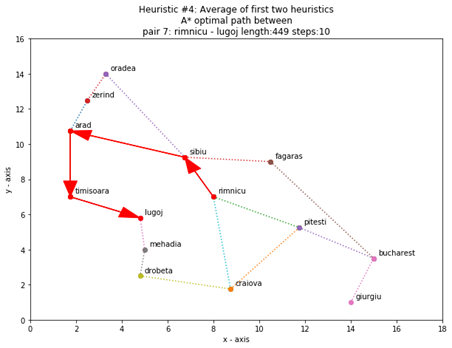

# Task
Study the effects of four different heuristics on A* search of the Romania roadmap.

The heuristics are as follows, where (x1,y1 and (x2,y2) are the location so of the two cities

Heuristic #1: Straight Line Distance [ (x2-x1)^2 + (y2-y1)^2)^1/2

Heuristic #2: Manhattan Distance (x2-x1)+(y2-y1)

Heuristic #3: Sum of first two heuristics

Heuristic #4: Average of first two heuristics

1. Write a python program that implements A* search for the snippet of the roadmap we did in class

2. Select a set of 10 city pairs on the map, where there are multiple routes for each pair (as in Arad, Bucharest), and establish the optimal path by hand between each pair.

3. Evaluate A* using each heuristic on all 10 pairs, and count the number of optimal paths returned

4. Plot your results

5. Write a document with two sections. In the first section, document your code. In the second section, include your plot and explain  in detail your results. Are there any general conclusions you can draw?

<b>Author :</b><b> Chengpi Wu<o:p></o:p></b>

<b><o:p>&nbsp;</o:p></b>

<b>Section</b><b> </b><b>1 AstarSearch.py<o:p></o:p></b>

<b>Section</b><b> </b><b>2 Results and
analysis<o:p></o:p></b>

In order to compare the results of the
same pairs easily, I adjusted the orders of graphs.<b><o:p></o:p></b>

<b style='mso-bidi-font-weight:normal'><!--[if gte vml 1]><v:shapetype
 id="_x0000_t75" coordsize="21600,21600" o:spt="75" o:preferrelative="t"
 path="m@4@5l@4@11@9@11@9@5xe" filled="f" stroked="f">
 <v:stroke joinstyle="miter"/>
 <v:formulas>
  <v:f eqn="if lineDrawn pixelLineWidth 0"/>
  <v:f eqn="sum @0 1 0"/>
  <v:f eqn="sum 0 0 @1"/>
  <v:f eqn="prod @2 1 2"/>
  <v:f eqn="prod @3 21600 pixelWidth"/>
  <v:f eqn="prod @3 21600 pixelHeight"/>
  <v:f eqn="sum @0 0 1"/>
  <v:f eqn="prod @6 1 2"/>
  <v:f eqn="prod @7 21600 pixelWidth"/>
  <v:f eqn="sum @8 21600 0"/>
  <v:f eqn="prod @7 21600 pixelHeight"/>
  <v:f eqn="sum @10 21600 0"/>
 </v:formulas>
 <v:path o:extrusionok="f" gradientshapeok="t" o:connecttype="rect"/>
 <o:lock v:ext="edit" aspectratio="t"/>
</v:shapetype><v:shape id="Picture_x0020_141" o:spid="_x0000_i1104" type="#_x0000_t75"
 style='width:271.2pt;height:208.8pt;visibility:visible;mso-wrap-style:square'>
 <v:imagedata src="AstarSearch_Readme_images/image001.png" o:title=""/>
 <o:lock v:ext="edit" aspectratio="f"/>
</v:shape><![endif]--><![if !vml]><![endif]><!--[if gte vml 1]><v:shape
 id="Picture_x0020_142" o:spid="_x0000_i1103" type="#_x0000_t75" style='width:271.2pt;
 height:208.8pt;visibility:visible;mso-wrap-style:square'>
 <v:imagedata src="AstarSearch_Readme_images/image003.png" o:title=""/>
 <o:lock v:ext="edit" aspectratio="f"/>
</v:shape><![endif]--><![if !vml]><![endif]><!--[if gte vml 1]><v:shape
 id="Picture_x0020_143" o:spid="_x0000_i1102" type="#_x0000_t75" style='width:271.2pt;
 height:208.8pt;visibility:visible;mso-wrap-style:square'>
 <v:imagedata src="AstarSearch_Readme_images/image005.png" o:title=""/>
 <o:lock v:ext="edit" aspectratio="f"/>
</v:shape><![endif]--><![if !vml]><![endif]><!--[if gte vml 1]><v:shape
 id="Picture_x0020_144" o:spid="_x0000_i1101" type="#_x0000_t75" style='width:271.2pt;
 height:208.8pt;visibility:visible;mso-wrap-style:square'>
 <v:imagedata src="AstarSearch_Readme_images/image007.png" o:title=""/>
 <o:lock v:ext="edit" aspectratio="f"/>
</v:shape><![endif]--><![if !vml]><![endif]></b><b><o:p></o:p></b>

<b> 
</b>

<b style='mso-bidi-font-weight:normal'><!--[if gte vml 1]><v:shape
 id="Picture_x0020_145" o:spid="_x0000_i1100" type="#_x0000_t75" style='width:271.2pt;
 height:208.8pt;visibility:visible;mso-wrap-style:square'>
 <v:imagedata src="AstarSearch_Readme_images/image009.png" o:title=""/>
</v:shape><![endif]--><![if !vml]><![endif]><!--[if gte vml 1]><v:shape
 id="Picture_x0020_146" o:spid="_x0000_i1099" type="#_x0000_t75" style='width:271.2pt;
 height:208.8pt;visibility:visible;mso-wrap-style:square'>
 <v:imagedata src="AstarSearch_Readme_images/image011.png" o:title=""/>
</v:shape><![endif]--><![if !vml]><![endif]><!--[if gte vml 1]><v:shape
 id="Picture_x0020_147" o:spid="_x0000_i1098" type="#_x0000_t75" style='width:271.2pt;
 height:208.8pt;visibility:visible;mso-wrap-style:square'>
 <v:imagedata src="AstarSearch_Readme_images/image013.png" o:title=""/>
</v:shape><![endif]--><![if !vml]><![endif]><!--[if gte vml 1]><v:shape
 id="Picture_x0020_148" o:spid="_x0000_i1097" type="#_x0000_t75" style='width:271.2pt;
 height:208.8pt;visibility:visible;mso-wrap-style:square'>
 <v:imagedata src="AstarSearch_Readme_images/image015.png" o:title=""/>
</v:shape><![endif]--><![if !vml]><![endif]><!--[if gte vml 1]><v:shape
 id="Picture_x0020_149" o:spid="_x0000_i1096" type="#_x0000_t75" style='width:271.2pt;
 height:208.8pt;visibility:visible;mso-wrap-style:square'>
 <v:imagedata src="AstarSearch_Readme_images/image017.png" o:title=""/>
</v:shape><![endif]--><![if !vml]><![endif]><!--[if gte vml 1]><v:shape
 id="Picture_x0020_150" o:spid="_x0000_i1095" type="#_x0000_t75" style='width:271.2pt;
 height:208.8pt;visibility:visible;mso-wrap-style:square'>
 <v:imagedata src="AstarSearch_Readme_images/image019.png" o:title=""/>
</v:shape><![endif]--><![if !vml]><![endif]><!--[if gte vml 1]><v:shape
 id="Picture_x0020_151" o:spid="_x0000_i1094" type="#_x0000_t75" style='width:271.2pt;
 height:208.8pt;visibility:visible;mso-wrap-style:square'>
 <v:imagedata src="AstarSearch_Readme_images/image021.png" o:title=""/>
</v:shape><![endif]--><![if !vml]><![endif]><!--[if gte vml 1]><v:shape
 id="Picture_x0020_152" o:spid="_x0000_i1093" type="#_x0000_t75" style='width:271.2pt;
 height:208.8pt;visibility:visible;mso-wrap-style:square'>
 <v:imagedata src="AstarSearch_Readme_images/image023.png" o:title=""/>
</v:shape><![endif]--><![if !vml]><![endif]><!--[if gte vml 1]><v:shape
 id="Picture_x0020_153" o:spid="_x0000_i1092" type="#_x0000_t75" style='width:271.2pt;
 height:208.8pt;visibility:visible;mso-wrap-style:square'>
 <v:imagedata src="AstarSearch_Readme_images/image025.png" o:title=""/>
</v:shape><![endif]--><![if !vml]><![endif]><!--[if gte vml 1]><v:shape
 id="Picture_x0020_154" o:spid="_x0000_i1091" type="#_x0000_t75" style='width:271.2pt;
 height:208.8pt;visibility:visible;mso-wrap-style:square'>
 <v:imagedata src="AstarSearch_Readme_images/image027.png" o:title=""/>
</v:shape><![endif]--><![if !vml]><![endif]><!--[if gte vml 1]><v:shape
 id="Picture_x0020_155" o:spid="_x0000_i1090" type="#_x0000_t75" style='width:271.2pt;
 height:208.8pt;visibility:visible;mso-wrap-style:square'>
 <v:imagedata src="AstarSearch_Readme_images/image029.png" o:title=""/>
</v:shape><![endif]--><![if !vml]><![endif]><!--[if gte vml 1]><v:shape
 id="Picture_x0020_156" o:spid="_x0000_i1089" type="#_x0000_t75" style='width:271.2pt;
 height:208.8pt;visibility:visible;mso-wrap-style:square'>
 <v:imagedata src="AstarSearch_Readme_images/image031.png" o:title=""/>
</v:shape><![endif]--><![if !vml]><![endif]><!--[if gte vml 1]><v:shape
 id="Picture_x0020_157" o:spid="_x0000_i1088" type="#_x0000_t75" style='width:271.2pt;
 height:208.8pt;visibility:visible;mso-wrap-style:square'>
 <v:imagedata src="AstarSearch_Readme_images/image033.png" o:title=""/>
</v:shape><![endif]--><![if !vml]><![endif]><!--[if gte vml 1]><v:shape
 id="Picture_x0020_158" o:spid="_x0000_i1087" type="#_x0000_t75" style='width:271.2pt;
 height:208.8pt;visibility:visible;mso-wrap-style:square'>
 <v:imagedata src="AstarSearch_Readme_images/image035.png" o:title=""/>
</v:shape><![endif]--><![if !vml]><![endif]><!--[if gte vml 1]><v:shape
 id="Picture_x0020_159" o:spid="_x0000_i1086" type="#_x0000_t75" style='width:271.2pt;
 height:208.8pt;visibility:visible;mso-wrap-style:square'>
 <v:imagedata src="AstarSearch_Readme_images/image037.png" o:title=""/>
</v:shape><![endif]--><![if !vml]><![endif]><!--[if gte vml 1]><v:shape
 id="Picture_x0020_160" o:spid="_x0000_i1085" type="#_x0000_t75" style='width:271.2pt;
 height:208.8pt;visibility:visible;mso-wrap-style:square'>
 <v:imagedata src="AstarSearch_Readme_images/image039.png" o:title=""/>
</v:shape><![endif]--><![if !vml]><![endif]><!--[if gte vml 1]><v:shape
 id="Picture_x0020_161" o:spid="_x0000_i1084" type="#_x0000_t75" style='width:271.2pt;
 height:208.8pt;visibility:visible;mso-wrap-style:square'>
 <v:imagedata src="AstarSearch_Readme_images/image041.png" o:title=""/>
</v:shape><![endif]--><![if !vml]><![endif]><!--[if gte vml 1]><v:shape
 id="Picture_x0020_162" o:spid="_x0000_i1083" type="#_x0000_t75" style='width:271.2pt;
 height:208.8pt;visibility:visible;mso-wrap-style:square'>
 <v:imagedata src="AstarSearch_Readme_images/image043.png" o:title=""/>
</v:shape><![endif]--><![if !vml]><![endif]><!--[if gte vml 1]><v:shape
 id="Picture_x0020_163" o:spid="_x0000_i1082" type="#_x0000_t75" style='width:271.2pt;
 height:208.8pt;visibility:visible;mso-wrap-style:square'>
 <v:imagedata src="AstarSearch_Readme_images/image045.png" o:title=""/>
</v:shape><![endif]--><![if !vml]><![endif]><!--[if gte vml 1]><v:shape
 id="Picture_x0020_164" o:spid="_x0000_i1081" type="#_x0000_t75" style='width:271.2pt;
 height:208.8pt;visibility:visible;mso-wrap-style:square'>
 <v:imagedata src="AstarSearch_Readme_images/image047.png" o:title=""/>
</v:shape><![endif]--><![if !vml]><![endif]><!--[if gte vml 1]><v:shape
 id="Picture_x0020_165" o:spid="_x0000_i1080" type="#_x0000_t75" style='width:271.2pt;
 height:208.8pt;visibility:visible;mso-wrap-style:square'>
 <v:imagedata src="AstarSearch_Readme_images/image049.png" o:title=""/>
</v:shape><![endif]--><![if !vml]><![endif]><!--[if gte vml 1]><v:shape
 id="Picture_x0020_166" o:spid="_x0000_i1079" type="#_x0000_t75" style='width:271.2pt;
 height:208.8pt;visibility:visible;mso-wrap-style:square'>
 <v:imagedata src="AstarSearch_Readme_images/image051.png" o:title=""/>
</v:shape><![endif]--><![if !vml]><![endif]><!--[if gte vml 1]><v:shape
 id="Picture_x0020_167" o:spid="_x0000_i1078" type="#_x0000_t75" style='width:271.2pt;
 height:208.8pt;visibility:visible;mso-wrap-style:square'>
 <v:imagedata src="AstarSearch_Readme_images/image053.png" o:title=""/>
</v:shape><![endif]--><![if !vml]><![endif]><!--[if gte vml 1]><v:shape
 id="Picture_x0020_168" o:spid="_x0000_i1077" type="#_x0000_t75" style='width:271.2pt;
 height:208.8pt;visibility:visible;mso-wrap-style:square'>
 <v:imagedata src="AstarSearch_Readme_images/image055.png" o:title=""/>
</v:shape><![endif]--><![if !vml]><![endif]><!--[if gte vml 1]><v:shape
 id="Picture_x0020_169" o:spid="_x0000_i1076" type="#_x0000_t75" style='width:271.2pt;
 height:208.8pt;visibility:visible;mso-wrap-style:square'>
 <v:imagedata src="AstarSearch_Readme_images/image057.png" o:title=""/>
</v:shape><![endif]--><![if !vml]><![endif]><!--[if gte vml 1]><v:shape
 id="Picture_x0020_170" o:spid="_x0000_i1075" type="#_x0000_t75" style='width:271.2pt;
 height:208.8pt;visibility:visible;mso-wrap-style:square'>
 <v:imagedata src="AstarSearch_Readme_images/image059.png" o:title=""/>
</v:shape><![endif]--><![if !vml]><![endif]><!--[if gte vml 1]><v:shape
 id="Picture_x0020_171" o:spid="_x0000_i1074" type="#_x0000_t75" style='width:271.2pt;
 height:208.8pt;visibility:visible;mso-wrap-style:square'>
 <v:imagedata src="AstarSearch_Readme_images/image061.png" o:title=""/>
</v:shape><![endif]--><![if !vml]><![endif]><!--[if gte vml 1]><v:shape
 id="Picture_x0020_172" o:spid="_x0000_i1073" type="#_x0000_t75" style='width:271.2pt;
 height:208.8pt;visibility:visible;mso-wrap-style:square'>
 <v:imagedata src="AstarSearch_Readme_images/image063.png" o:title=""/>
</v:shape><![endif]--><![if !vml]><![endif]><!--[if gte vml 1]><v:shape
 id="Picture_x0020_173" o:spid="_x0000_i1072" type="#_x0000_t75" style='width:271.2pt;
 height:208.8pt;visibility:visible;mso-wrap-style:square'>
 <v:imagedata src="AstarSearch_Readme_images/image065.png" o:title=""/>
</v:shape><![endif]--><![if !vml]><![endif]><!--[if gte vml 1]><v:shape
 id="Picture_x0020_174" o:spid="_x0000_i1071" type="#_x0000_t75" style='width:271.2pt;
 height:208.8pt;visibility:visible;mso-wrap-style:square'>
 <v:imagedata src="AstarSearch_Readme_images/image067.png" o:title=""/>
</v:shape><![endif]--><![if !vml]><![endif]><!--[if gte vml 1]><v:shape
 id="Picture_x0020_175" o:spid="_x0000_i1070" type="#_x0000_t75" style='width:271.2pt;
 height:208.8pt;visibility:visible;mso-wrap-style:square'>
 <v:imagedata src="AstarSearch_Readme_images/image069.png" o:title=""/>
</v:shape><![endif]--><![if !vml]><![endif]><!--[if gte vml 1]><v:shape
 id="Picture_x0020_176" o:spid="_x0000_i1069" type="#_x0000_t75" style='width:271.2pt;
 height:208.8pt;visibility:visible;mso-wrap-style:square'>
 <v:imagedata src="AstarSearch_Readme_images/image071.png" o:title=""/>
</v:shape><![endif]--><![if !vml]><![endif]><!--[if gte vml 1]><v:shape
 id="Picture_x0020_177" o:spid="_x0000_i1068" type="#_x0000_t75" style='width:271.2pt;
 height:208.8pt;visibility:visible;mso-wrap-style:square'>
 <v:imagedata src="AstarSearch_Readme_images/image073.png" o:title=""/>
</v:shape><![endif]--><![if !vml]><![endif]><!--[if gte vml 1]><v:shape
 id="Picture_x0020_178" o:spid="_x0000_i1067" type="#_x0000_t75" style='width:271.2pt;
 height:208.8pt;visibility:visible;mso-wrap-style:square'>
 <v:imagedata src="AstarSearch_Readme_images/image075.png" o:title=""/>
</v:shape><![endif]--><![if !vml]><![endif]><!--[if gte vml 1]><v:shape
 id="Picture_x0020_179" o:spid="_x0000_i1066" type="#_x0000_t75" style='width:271.2pt;
 height:208.8pt;visibility:visible;mso-wrap-style:square'>
 <v:imagedata src="AstarSearch_Readme_images/image077.png" o:title=""/>
</v:shape><![endif]--><![if !vml]><![endif]><!--[if gte vml 1]><v:shape
 id="Picture_x0020_180" o:spid="_x0000_i1065" type="#_x0000_t75" style='width:271.2pt;
 height:208.8pt;visibility:visible;mso-wrap-style:square'>
 <v:imagedata src="AstarSearch_Readme_images/image079.png" o:title=""/>
</v:shape><![endif]--><![if !vml]><![endif]></b><b><o:p></o:p></b>

<b> 
</b>

<b><o:p>&nbsp;</o:p></b>

1.By the A* search code, we could find
out that in some cases it could not generate the optimal paths because the
heuristic function defined is not admissible. ( pair
3, heuristic #3 ; pair 7, #1, #2, #4; pair 8, #2, #3; pair 9, #3)<o:p></o:p>

2.In some cases, we could get the
optimal paths with different heuristic functions though the numbers of steps
are different. (for example, pair 10, #1,#2,#3,#4 have
7,4,4,5 steps respectively.)<o:p></o:p>

3.Why can’t the search algorithm find
the optimal routes in some cases? Because the h(n) with the multiplier (or ratio scale, I guess it’s the real meaning of the multiplier)
25 sometimes would overestimate the cost to the goal, so it’s not admissible.
Then the result wouldn’t be optimal.<o:p></o:p>

4.By improving A* search code, I got
the same paths in each pair of cities with different heuristic functions. And
we can check these results are all optimal paths.  (Please find the improved code and its result
at the end.)<o:p></o:p>

5.In my new code, I used different so-called
“ratio scales”(multipliers) defined by the smallest ratio
of the length of real route to the “distance”(straight line distance, Manhattan
distance, sum and average).<o:p></o:p>

I used several functions to calculate
ratio scales for each definition of cost instead of the value 25 which Prof.
Lyons suggest us to use. <o:p></o:p>

For example:<o:p></o:p>

scaleSld (): calculate smallest ratio of length of
real route between two cities to the straight line
distance between two cities<o:p></o:p>

And I define a dictionary named disDic to save the method’s name, description and ratio
scales for each heurisitic function.<o:p></o:p>

disDic = {'sld':('Heuristic
#1: Straight Line Distance',scaleSld),etc.}<o:p></o:p>

In the method of ASTARtreesearch(start,goal,heuristic), I calculate
F(n) =g(n) + h(n) by: <o:p></o:p>

h = globals()[heuristic](city,goal) * ratioScale, <o:p></o:p>

where ratioScale
= disDic.get(heuristic)[1]<o:p></o:p>

Based on the given map data, I got 4
values of ratio scale for different distance we defined:<o:p></o:p>

Ratio Scale of sld = 23.43<o:p></o:p>

Ratio Scale of md = 17.64<o:p></o:p>

Ratio Scale of sumsldmd = 10.06<o:p></o:p>

Ratio Scale of avgsldmd = 20.12<o:p></o:p>

Notice the Ratio Scale of sld (straight line distance) is very close to the value 25,
however, the other ratio scale values are smaller, which could ensure that h(n)&lt;h*(n)
so that h(n) could be admissible (however, the function is not strictly
admissible theoretically, I will discuss that as follows).<o:p></o:p>

6. Construct a good h(n) (estimating
ratio scale in this case) is challenging. First, if h(n) can’t satisfy the
condition h(n)&lt;h*(n), h(n) is not admissible and A* search would not be
optimal. Second, if the heuristic function underestimates the cost to the goal
too much, the A* search would be inefficient because the algorithm has to
expand many nodes with smaller h(n) but bigger g(n) (which means we give a
bigger weight to the cost so far in the estimation). <o:p></o:p>

It could be seen that all the
h(n)=distance*(ratio scale) could cause to the optimal paths, though they take
different steps in some cases. In this case, for pair 2 and 7, heuristic
function of adjusted straight line distance takes least steps (the others are
the same) (for example, in the results of the improved code, for pair7,
heuristic #1 has 10 steps though #2,#3,#4 have 11 steps); for pair 8,9,10,
heuristic function of adjusted straight line distance takes most steps (the
others are the same).<o:p></o:p>

All though the ratio scales(multipliers)
of different distances I calculated do work in this case, it is not strictly
admissible because the condition h(n)&lt;h*(n) can’t be satisfied in any cases.
(Although for any between two
connected cities nearby, the adjusted distance &lt; the length of real route,
for two cities not connected directly, the inequality doesn’t
follow sigma additivity strictly.) However, it is acceptable in most cases, or
it’s good enough as an estimate.<o:p></o:p>

<b>7.
Conclusion: <o:p></o:p></b>

A* search is optimal if we could
define heuristic function correctly. (h(n) satisfy the condition h(n)&lt;h*(n),
where h*(n) is the real cost to the goal, and the h(n) don’t underestimate too
much).<o:p></o:p>

Through different but admissible heuristic
functions (h(n)=distance*(ratio scale)), we could get the same optimal paths
even if we use different heuristic functions. The less h(n) underestimate, the
more efficient the algorithm is. <o:p></o:p>

8. The improved code and its result
are as follows:<o:p></o:p>

ASTAR_ratioScale.py<o:p></o:p>

<b>###############################################<o:p></o:p></b>

<b>#    
Created on Thu Sep 
15 19:02:04 2020    <o:p></o:p></b>

<b>#      
Assignment #1:    Chengpi Wu          <o:p></o:p></b>

<b>###############################################<o:p></o:p></b>

<b><o:p>&nbsp;</o:p></b>

<b>#Part of the romania
roadmapp<o:p></o:p></b>

<b><o:p>&nbsp;</o:p></b>

<b>roadmap =
[(&quot;arad&quot;,&quot;zerind&quot;,75),
(&quot;arad&quot;,&quot;sibiu&quot;,140),(&quot;arad&quot;,&quot;timisoara&quot;,118),(&quot;zerind&quot;,&quot;oradea&quot;,71),<o:p></o:p></b>

<b>      
(&quot;oradea&quot;,&quot;sibiu&quot;,151),(&quot;timisoara&quot;,&quot;lugoj&quot;,111),(&quot;lugoj&quot;,&quot;mehadia&quot;,70),(&quot;mehadia&quot;,&quot;drobeta&quot;,75),<o:p></o:p></b>

<b>      
(&quot;drobeta&quot;,&quot;craiova&quot;,120),(&quot;craiova&quot;,&quot;rimnicu&quot;,146),(&quot;rimnicu&quot;,&quot;sibiu&quot;,80),<o:p></o:p></b>

<b>      
(&quot;craiova&quot;,&quot;pitesti&quot;,138),(&quot;rimnicu&quot;,&quot;pitesti&quot;,97),(&quot;sibiu&quot;,&quot;fagaras&quot;,99),<o:p></o:p></b>

<b>      
(&quot;pitesti&quot;,&quot;bucharest&quot;,101),
(&quot;fagaras&quot;,&quot;bucharest&quot;,211),
(&quot;giurgiu&quot;,&quot;bucharest&quot;,90)]<o:p></o:p></b>

<b><o:p>&nbsp;</o:p></b>

<b>location={&quot;arad&quot;:(1.75,10.75),
&quot;zerind&quot;:(2.5,12.5), &quot;sibiu&quot;:(6.75,9.25),<o:p></o:p></b>

<b>          &quot;timisoara&quot;:(1.75,7),
&quot;oradea&quot;:(3.3,14), &quot;lugoj&quot;:(4.8,5.8),<o:p></o:p></b>

<b>          &quot;mehadia&quot;:(5,4),
&quot;drobeta&quot;:(4.8,2.5), &quot;craiova&quot;:(8.75,1.75),<o:p></o:p></b>

<b>          &quot;rimnicu&quot;:(8,7),
&quot;fagaras&quot;:(10.5, 9), &quot;pitesti&quot;:(11.75,5.25),<o:p></o:p></b>

<b>          &quot;bucharest&quot;:(15,3.5),
&quot;giurgiu&quot;:(14,1) }<o:p></o:p></b>

<b><o:p>&nbsp;</o:p></b>

<b># Successor fn:
successor(state,action)=list
of states arrived at after action in state<o:p></o:p></b>

<b><o:p>&nbsp;</o:p></b>

<b>def successor(roadmap,city):<o:p></o:p></b>

<b>   
&quot;&quot;&quot;generate list of successors of startcity
in roadmap&quot;&quot;&quot;<o:p></o:p></b>

<b>   
# assumes format of roadmap and that city is a strong<o:p></o:p></b>

<b>   
successorList=[]<o:p></o:p></b>

<b>   
for mapentry in roadmap:<o:p></o:p></b>

<b>       
if mapentry[0]==city:<o:p></o:p></b>

<b>            successorList.append( (mapentry[1], mapentry[2]) )<o:p></o:p></b>

<b>       
elif mapentry[1]==city:<o:p></o:p></b>

<b>            successorList.append( (mapentry[0], mapentry[2]) )<o:p></o:p></b>

<b>   
return successorList<o:p></o:p></b>

<b><o:p>&nbsp;</o:p></b>

<b>print(</b><b>'\n-----------------
ASTAR search -------------------\n')<o:p></o:p></b>

<b><o:p>&nbsp;</o:p></b>

<b>import math<o:p></o:p></b>

<b><o:p>&nbsp;</o:p></b>

<b># define diffrent
&quot;distances&quot;<o:p></o:p></b>

<b><o:p>&nbsp;</o:p></b>

<b>def sld(X,Y):  #1: Straight
Line Distance  [ (x2-x1)^2 +
(y2-y1)^2)^1/2<o:p></o:p></b>

<b>   
return round(math.sqrt((location[Y][0]-location[X][0])**2
+  (location[Y][1]-location[X][1])**2) ,
2)<o:p></o:p></b>

<b>   
<o:p></o:p></b>

<b>def md(X,Y):   #2: Manhattan Distance (x2-x1)+(y2-y1)<o:p></o:p></b>

<b>   
return round(abs(location[Y][0]-location[X][0]) +  abs(location[Y][1]-location[X][1]) ,2)<o:p></o:p></b>

<b><o:p>&nbsp;</o:p></b>

<b>def sumsldmd(X,Y):#3: Sum of first two heuristics<o:p></o:p></b>

<b>   
return sld(X,Y) +
md(X,Y)<o:p></o:p></b>

<b><o:p>&nbsp;</o:p></b>

<b>def avgsldmd(X,Y):#4: Average of first two heuristics<o:p></o:p></b>

<b>   
return round((sld(X,Y)
+ md(X,Y))/2,2)<o:p></o:p></b>

<b> 
<o:p></o:p></b>

<b># calculate scale ratio as the
multiplier of distance - begin<o:p></o:p></b>

<b><o:p>&nbsp;</o:p></b>

<b># calculate smallest ratio of length of
real route/Sld between two cities     <o:p></o:p></b>

<b>def scaleSld():<o:p></o:p></b>

<b>   
minRatio = 999999<o:p></o:p></b>

<b>   
for i in range(0,len(roadmap)):<o:p></o:p></b>

<b>       
ratio = roadmap[i][2]/sld(roadmap[i][0],roadmap[i][1])<o:p></o:p></b>

<b>       
if ratio &lt; minRatio:<o:p></o:p></b>

<b>            minRatio
= ratio<o:p></o:p></b>

<b>   
return round(minRatio,2)<o:p></o:p></b>

<b>       
<o:p></o:p></b>

<b># calculate smallest ratio of length of
real route/Md  between
two cities   <o:p></o:p></b>

<b>def scaleMd():<o:p></o:p></b>

<b>   
minRatio = 999999<o:p></o:p></b>

<b>   
for i in range(0,len(roadmap)):<o:p></o:p></b>

<b>       
ratio = roadmap[i][2]/md(roadmap[i][0],roadmap[i][1])<o:p></o:p></b>

<b>       
if ratio &lt; minRatio:<o:p></o:p></b>

<b>            minRatio
= ratio<o:p></o:p></b>

<b>   
return round(minRatio,2)<o:p></o:p></b>

<b><o:p>&nbsp;</o:p></b>

<b># calculate smallest ratio of length of
real route/(sum of Sld and
Md) between two cities    <o:p></o:p></b>

<b>def scaleSumsldmd():<o:p></o:p></b>

<b>   
minRatio = 999999<o:p></o:p></b>

<b>   
for i in range(0,len(roadmap)):<o:p></o:p></b>

<b>       
ratio = roadmap[i][2]/sumsldmd(roadmap[i][0],roadmap[i][1])<o:p></o:p></b>

<b>       
if ratio &lt; minRatio:<o:p></o:p></b>

<b>            minRatio
= ratio<o:p></o:p></b>

<b>   
return round(minRatio,2)<o:p></o:p></b>

<b><o:p>&nbsp;</o:p></b>

<b><o:p>&nbsp;</o:p></b>

<b># calculate smallest ratio of length of
real route/(average of Sld
and Md) between two cities <o:p></o:p></b>

<b>def scaleAvgsldmd():<o:p></o:p></b>

<b>   
minRatio = 999999<o:p></o:p></b>

<b>   
for i in range(0,len(roadmap)):<o:p></o:p></b>

<b>       
ratio = roadmap[i][2]/avgsldmd(roadmap[i][0],roadmap[i][1])<o:p></o:p></b>

<b>       
if ratio &lt; minRatio:<o:p></o:p></b>

<b>            minRatio
= ratio<o:p></o:p></b>

<b>   
return round(minRatio,2)<o:p></o:p></b>

<b>   
<o:p></o:p></b>

<b>          <o:p></o:p></b>

<b># assign 4 ratio scales as the
multiplier of distance<o:p></o:p></b>

<b>scaleSld</b><b> = scaleSld()<o:p></o:p></b>

<b>scaleMd</b><b> = scaleMd()<o:p></o:p></b>

<b>scaleSumsldmd</b><b> = scaleSumsldmd()<o:p></o:p></b>

<b>scaleAvgsldmd</b><b> = scaleAvgsldmd()<o:p></o:p></b>

<b><o:p>&nbsp;</o:p></b>

<b>print(</b><b>&quot;Ratio
Scale of sld =&quot;,scaleSld)<o:p></o:p></b>

<b>print(</b><b>&quot;Ratio
Scale of md =&quot;,scaleMd)<o:p></o:p></b>

<b>print(</b><b>&quot;Ratio
Scale of sumsldmd =&quot;,scaleSumsldmd)<o:p></o:p></b>

<b>print(</b><b>&quot;Ratio
Scale of avgsldmd =&quot;,scaleAvgsldmd)<o:p></o:p></b>

<b><o:p>&nbsp;</o:p></b>

<b><o:p>&nbsp;</o:p></b>

<b>####################################################<o:p></o:p></b>

<b>#          calculate scale ratio - end<o:p></o:p></b>

<b><o:p>&nbsp;</o:p></b>

<b>disDic</b><b> = {'sld':('Heuristic #1: Straight Line Distance',scaleSld),'md':('Heuristic #2:
Manhattan Distance',scaleMd), <o:p></o:p></b>

<b>              'sumsldmd':('Heuristic
#3: Sum of first two heuristics',scaleSumsldmd),'avgsldmd':('Heuristic #4: Average of first two heuristics',scaleAvgsldmd)}<o:p></o:p></b>

<b><o:p>&nbsp;</o:p></b>

<b>def ASTARtreesearch(start,goal,heuristic): # not
finished! everytime just search the shortest branch!<o:p></o:p></b>

<b>   
&quot;&quot;&quot;carry out a tree search for goal from this fringe (set
of unexpanded nodes to search)&quot;&quot;&quot;<o:p></o:p></b>

<b>   
# assumes that the start state is in the fringe<o:p></o:p></b>

<b>   
print(&quot;\n\n##### &quot;,disDic.get(heuristic)[0],&quot;#####\n&quot;)<o:p></o:p></b>

<b>   
ratioScale = disDic.get(heuristic)[1]<o:p></o:p></b>

<b>   
rubbish = list() # list of already seached cities<o:p></o:p></b>

<b>   
routes = list()<o:p></o:p></b>

<b>   
fringe = [ [start,[], 0, round(globals()[heuristic](start,goal)*ratioScale ,2)] ]<o:p></o:p></b>

<b>   
steps = 0<o:p></o:p></b>

<b>   
while len(fringe)&gt;0:<o:p></o:p></b>

<b>       
fringe = sorted(fringe,key=lambda
x:(x[3]))<o:p></o:p></b>

<b>       
rootnode = fringe.pop(0) # thisis the strategy - just pick the first one<o:p></o:p></b>

<b>       
root = rootnode[0]<o:p></o:p></b>

<b>       
if root == goal:<o:p></o:p></b>

<b>            print ('\nFound
goal and the route is: \n',rootnode[1]+[goal],
'\n length: ', rootnode[2] ,'\nsteps:
',steps,'\n')<o:p></o:p></b>

<b>            routes.append([rootnode[1]+[goal],rootnode[2]])<o:p></o:p></b>

<b>            return rootnode[1]+[goal],rootnode[2],steps<o:p></o:p></b>

<b>       
nextcitylist = successor(roadmap,root) # assumes global scope roadmap<o:p></o:p></b>

<b>       
rubbish.append(root)<o:p></o:p></b>

<b>       
#<o:p></o:p></b>

<b>       
fringecity=list() #
can't check fringe directly for duplicates so extract cities to list<o:p></o:p></b>

<b>        for searchnode
in fringe:<o:p></o:p></b>

<b>            fringecity.append(searchnode[0])<o:p></o:p></b>

<b>       
#ASTAR<o:p></o:p></b>

<b>       
steps += 1<o:p></o:p></b>

<b>       
# print('ASTAR search: ', root, round(rootnode[3],2))<o:p></o:p></b>

<b>       
# print(nextcitylist)<o:p></o:p></b>

<b>       
for mapentry in nextcitylist:
<o:p></o:p></b>

<b>            city = mapentry[0]<o:p></o:p></b>

<b>            g = rootnode[2] # cost happened<o:p></o:p></b>

<b>            # h = sld(city,goal)<o:p></o:p></b>

<b>            h = round( globals()[heuristic](city,goal)
* ratioScale ,2)<o:p></o:p></b>

<b>            f = g + h<o:p></o:p></b>

<b>            length = rootnode[2] + mapentry[1]<o:p></o:p></b>

<b>            if not city in fringecity
and not city in rubbish or city == goal: # <o:p></o:p></b>

<b>                newnode=[city,rootnode[1]+[root], length,
f] # expand the path by one city<o:p></o:p></b>

<b>                fringe.append(newnode)# put
them at the end<o:p></o:p></b>

<b>   
if routes:<o:p></o:p></b>

<b>       
return routes<o:p></o:p></b>

<b>   
else:<o:p></o:p></b>

<b>       
return &quot;No route to &quot;+goal<o:p></o:p></b>

<b>       
<o:p></o:p></b>

<b>#    
define a city pairs list<o:p></o:p></b>

<b>pairsCity</b><b> = [('drobeta', 'zerind'), ('fagaras', 'mehadia'), ('timisoara', 'bucharest'), ('bucharest', 'mehadia'), <o:p></o:p></b>

<b>             ('bucharest',
'zerind'), ('oradea', 'drobeta'), ('rimnicu', 'lugoj'), ('timisoara', 'giurgiu'), <o:p></o:p></b>

<b>             ('lugoj',
'fagaras'), ('zerind', 'craiova')]<o:p></o:p></b>

<b>  
<o:p></o:p></b>

<b>print(</b><b>&quot;\nCity pairs: \n&quot;,pairsCity)<o:p></o:p></b>

<b><o:p>&nbsp;</o:p></b>

<b>print(</b><b>&quot;\n\n-----
Plot optimal paths -----\n&quot;)<o:p></o:p></b>

<b><o:p>&nbsp;</o:p></b>

<b><o:p>&nbsp;</o:p></b>

<b>import matplotlib.pyplot as plt <o:p></o:p></b>

<b><o:p>&nbsp;</o:p></b>

<b># convert the coordinate to a list to
plot<o:p></o:p></b>

<b>coord</b><b> = location.values()<o:p></o:p></b>

<b>cityCoordlist</b><b> =
list(zip(*coord))<o:p></o:p></b>

<b>cityCoordinate</b><b> = [list(x)
for x in cityCoordlist]<o:p></o:p></b>

<b><o:p>&nbsp;</o:p></b>

<b>cityList</b><b> = list(location.keys())<o:p></o:p></b>

<b><o:p>&nbsp;</o:p></b>

<b>#    
draw original map - begin<o:p></o:p></b>

<b>def drawMap():<o:p></o:p></b>

<b>   
plt.axis([0, 18, 0,
16]) <o:p></o:p></b>

<b>   
# naming the x axis <o:p></o:p></b>

<b>   
plt.xlabel('x -
axis') <o:p></o:p></b>

<b>   
# naming the y axis <o:p></o:p></b>

<b>   
plt.ylabel('y -
axis')     <o:p></o:p></b>

<b>   
for i, txt in enumerate(cityList):<o:p></o:p></b>

<b>       
plt.annotate(txt, (cityCoordinate[0][i]+0.2, cityCoordinate[1][i]+0.2))<o:p></o:p></b>

<b>   
for i,pair in
enumerate(roadmap):<o:p></o:p></b>

<b>       
plt.plot([location[roadmap[i][0]][0],location[roadmap[i][1]][0]],
[location[roadmap[i][0]][1],location[roadmap[i][1]][1]], marker = 'o', linestyle=':')<o:p></o:p></b>

<b><o:p>&nbsp;</o:p></b>

<b>#    
draw original map - end<o:p></o:p></b>

<b><o:p>&nbsp;</o:p></b>

<b>#    
draw optimal route - begin<o:p></o:p></b>

<b> <o:p></o:p></b>

<b>def drawArrow(cityA, cityB):<o:p></o:p></b>

<b>   
location.get(cityA)[0]<o:p></o:p></b>

<b>   
plt.plot([location.get(cityA)[0],location.get(cityB)[0]],[location.get(cityA)[1],location.get(cityB)[1]],
marker = 'o', color='red')<o:p></o:p></b>

<b>   
plt.arrow(location.get(cityA)[0],location.get(cityA)[1], location.get(cityB)[0] - location.get(cityA)[0], location.get(cityB)[1] - location.get(cityA)[1],<o:p></o:p></b>

<b>              head_width=0.6,
length_includes_head=True,color='red')<o:p></o:p></b>

<b><o:p>&nbsp;</o:p></b>

<b>def drawRoute(routeList):<o:p></o:p></b>

<b>   
for i in range(0,len(routeList)-1):<o:p></o:p></b>

<b>       
drawArrow(routeList[i],routeList[i+1])<o:p></o:p></b>

<b><o:p>&nbsp;</o:p></b>

<b>#    
draw optimal route - end<o:p></o:p></b>

<b> 
<o:p></o:p></b>

<b>#    
draw optimal route of 10 pairs - begin<o:p></o:p></b>

<b><o:p>&nbsp;</o:p></b>

<b>for i,pair in enumerate(pairsCity):<o:p></o:p></b>

<b>   
for numHeur in range(1,5):
# run all heuristics.<o:p></o:p></b>

<b>       
fig = plt.figure(figsize=(10, 7))<o:p></o:p></b>

<b>       
print(&quot;----- pair &quot;,i+1,pair,&quot;
-----&quot;)<o:p></o:p></b>

<b>       
drawMap()<o:p></o:p></b>

<b>       
routeResult,length,steps
= ASTARtreesearch(pair[0],pair[1],list(disDic.keys())[numHeur-1])<o:p></o:p></b>

<b>       
drawRoute(routeResult)<o:p></o:p></b>

<b>       
# giving a title to the graph <o:p></o:p></b>

<b>       
plt.title(list(disDic.values())[numHeur-1][0] +'\nA*
optimal path between\npair' + &quot; &quot; +
str(i+1) + &quot;: &quot; + pair[0] + ' - ' + pair[1] + ' length:' +
str(length) + ' steps:' + str(steps)) <o:p></o:p></b>

<b>       
plt.show() <o:p></o:p></b>

<b>       
plt.close()<o:p></o:p></b>

<b><o:p>&nbsp;</o:p></b>

<b>#    
draw optimal route of 10 pairs - end<o:p></o:p></b>

<b><o:p>&nbsp;</o:p></b>

<b><o:p>&nbsp;</o:p></b>

<b style='mso-bidi-font-weight:normal'><!--[if gte vml 1]><v:shape id="Picture_x0020_81" o:spid="_x0000_i1064"
 type="#_x0000_t75" style='width:276.6pt;height:208.8pt;visibility:visible;
 mso-wrap-style:square'>
 <v:imagedata src="AstarSearch_Readme_images/image001.png" o:title=""/>
 <o:lock v:ext="edit" aspectratio="f"/>
</v:shape><![endif]--><![if !vml]><![endif]><!--[if gte vml 1]><v:shape
 id="Picture_x0020_82" o:spid="_x0000_i1063" type="#_x0000_t75" style='width:276.6pt;
 height:208.8pt;visibility:visible;mso-wrap-style:square'>
 <v:imagedata src="AstarSearch_Readme_images/image082.png" o:title=""/>
 <o:lock v:ext="edit" aspectratio="f"/>
</v:shape><![endif]--><![if !vml]><![endif]><!--[if gte vml 1]><v:shape
 id="Picture_x0020_83" o:spid="_x0000_i1062" type="#_x0000_t75" style='width:276.6pt;
 height:208.8pt;visibility:visible;mso-wrap-style:square'>
 <v:imagedata src="AstarSearch_Readme_images/image084.png" o:title=""/>
 <o:lock v:ext="edit" aspectratio="f"/>
</v:shape><![endif]--><![if !vml]><![endif]><!--[if gte vml 1]><v:shape
 id="Picture_x0020_84" o:spid="_x0000_i1061" type="#_x0000_t75" style='width:276.6pt;
 height:208.8pt;visibility:visible;mso-wrap-style:square'>
 <v:imagedata src="AstarSearch_Readme_images/image007.png" o:title=""/>
 <o:lock v:ext="edit" aspectratio="f"/>
</v:shape><![endif]--><![if !vml]><![endif]></b><b><o:p></o:p></b>

<b> 
</b>

<b><o:p>&nbsp;</o:p></b>

<!--[if gte vml 1]><v:shape id="Picture_x0020_186"
 o:spid="_x0000_i1060" type="#_x0000_t75" style='width:275.4pt;height:211.8pt;
 visibility:visible;mso-wrap-style:square'>
 <v:imagedata src="AstarSearch_Readme_images/image087.png" o:title=""/>
</v:shape><![endif]--><![if !vml]><![endif]><!--[if gte vml 1]><v:shape
 id="Picture_x0020_185" o:spid="_x0000_i1059" type="#_x0000_t75" style='width:280.8pt;
 height:3in;visibility:visible;mso-wrap-style:square'>
 <v:imagedata src="AstarSearch_Readme_images/image089.png" o:title=""/>
</v:shape><![endif]--><![if !vml]><![endif]><b
style='mso-bidi-font-weight:normal'><!--[if gte vml 1]><v:shape
 id="Picture_x0020_87" o:spid="_x0000_i1058" type="#_x0000_t75" style='width:276.6pt;
 height:208.8pt;visibility:visible;mso-wrap-style:square'>
 <v:imagedata src="AstarSearch_Readme_images/image091.png" o:title=""/>
</v:shape><![endif]--><![if !vml]><![endif]><!--[if gte vml 1]><v:shape
 id="Picture_x0020_88" o:spid="_x0000_i1057" type="#_x0000_t75" style='width:276.6pt;
 height:208.8pt;visibility:visible;mso-wrap-style:square'>
 <v:imagedata src="AstarSearch_Readme_images/image093.png" o:title=""/>
</v:shape><![endif]--><![if !vml]><![endif]><!--[if gte vml 1]><v:shape
 id="Picture_x0020_89" o:spid="_x0000_i1056" type="#_x0000_t75" style='width:276.6pt;
 height:208.8pt;visibility:visible;mso-wrap-style:square'>
 <v:imagedata src="AstarSearch_Readme_images/image095.png" o:title=""/>
</v:shape><![endif]--><![if !vml]><![endif]><!--[if gte vml 1]><v:shape
 id="Picture_x0020_90" o:spid="_x0000_i1055" type="#_x0000_t75" style='width:276.6pt;
 height:208.8pt;visibility:visible;mso-wrap-style:square'>
 <v:imagedata src="AstarSearch_Readme_images/image097.png" o:title=""/>
</v:shape><![endif]--><![if !vml]><![endif]><!--[if gte vml 1]><v:shape
 id="Picture_x0020_91" o:spid="_x0000_i1054" type="#_x0000_t75" style='width:276.6pt;
 height:208.8pt;visibility:visible;mso-wrap-style:square'>
 <v:imagedata src="AstarSearch_Readme_images/image099.png" o:title=""/>
</v:shape><![endif]--><![if !vml]><![endif]><!--[if gte vml 1]><v:shape
 id="Picture_x0020_92" o:spid="_x0000_i1053" type="#_x0000_t75" style='width:276.6pt;
 height:208.8pt;visibility:visible;mso-wrap-style:square'>
 <v:imagedata src="AstarSearch_Readme_images/image023.png" o:title=""/>
</v:shape><![endif]--><![if !vml]><![endif]><!--[if gte vml 1]><v:shape
 id="Picture_x0020_93" o:spid="_x0000_i1052" type="#_x0000_t75" style='width:276.6pt;
 height:208.8pt;visibility:visible;mso-wrap-style:square'>
 <v:imagedata src="AstarSearch_Readme_images/image025.png" o:title=""/>
</v:shape><![endif]--><![if !vml]><![endif]><!--[if gte vml 1]><v:shape
 id="Picture_x0020_94" o:spid="_x0000_i1051" type="#_x0000_t75" style='width:276.6pt;
 height:208.8pt;visibility:visible;mso-wrap-style:square'>
 <v:imagedata src="AstarSearch_Readme_images/image103.png" o:title=""/>
</v:shape><![endif]--><![if !vml]><![endif]><!--[if gte vml 1]><v:shape
 id="Picture_x0020_95" o:spid="_x0000_i1050" type="#_x0000_t75" style='width:276.6pt;
 height:208.8pt;visibility:visible;mso-wrap-style:square'>
 <v:imagedata src="AstarSearch_Readme_images/image105.png" o:title=""/>
</v:shape><![endif]--><![if !vml]><![endif]><!--[if gte vml 1]><v:shape
 id="Picture_x0020_96" o:spid="_x0000_i1049" type="#_x0000_t75" style='width:276.6pt;
 height:208.8pt;visibility:visible;mso-wrap-style:square'>
 <v:imagedata src="AstarSearch_Readme_images/image107.png" o:title=""/>
</v:shape><![endif]--><![if !vml]><![endif]><!--[if gte vml 1]><v:shape
 id="Picture_x0020_97" o:spid="_x0000_i1048" type="#_x0000_t75" style='width:276.6pt;
 height:208.8pt;visibility:visible;mso-wrap-style:square'>
 <v:imagedata src="AstarSearch_Readme_images/image033.png" o:title=""/>
</v:shape><![endif]--><![if !vml]><![endif]><!--[if gte vml 1]><v:shape
 id="Picture_x0020_98" o:spid="_x0000_i1047" type="#_x0000_t75" style='width:276.6pt;
 height:208.8pt;visibility:visible;mso-wrap-style:square'>
 <v:imagedata src="AstarSearch_Readme_images/image110.png" o:title=""/>
</v:shape><![endif]--><![if !vml]><![endif]><!--[if gte vml 1]><v:shape
 id="Picture_x0020_99" o:spid="_x0000_i1046" type="#_x0000_t75" style='width:276.6pt;
 height:208.8pt;visibility:visible;mso-wrap-style:square'>
 <v:imagedata src="AstarSearch_Readme_images/image112.png" o:title=""/>
</v:shape><![endif]--><![if !vml]><![endif]><!--[if gte vml 1]><v:shape
 id="Picture_x0020_100" o:spid="_x0000_i1045" type="#_x0000_t75" style='width:276.6pt;
 height:208.8pt;visibility:visible;mso-wrap-style:square'>
 <v:imagedata src="AstarSearch_Readme_images/image114.png" o:title=""/>
</v:shape><![endif]--><![if !vml]><![endif]><!--[if gte vml 1]><v:shape
 id="Picture_x0020_101" o:spid="_x0000_i1044" type="#_x0000_t75" style='width:276.6pt;
 height:208.8pt;visibility:visible;mso-wrap-style:square'>
 <v:imagedata src="AstarSearch_Readme_images/image041.png" o:title=""/>
 <o:lock v:ext="edit" aspectratio="f"/>
</v:shape><![endif]--><![if !vml]><![endif]><!--[if gte vml 1]><v:shape
 id="Picture_x0020_102" o:spid="_x0000_i1043" type="#_x0000_t75" style='width:276.6pt;
 height:208.8pt;visibility:visible;mso-wrap-style:square'>
 <v:imagedata src="AstarSearch_Readme_images/image117.png" o:title=""/>
 <o:lock v:ext="edit" aspectratio="f"/>
</v:shape><![endif]--><![if !vml]><![endif]><!--[if gte vml 1]><v:shape
 id="Picture_x0020_103" o:spid="_x0000_i1042" type="#_x0000_t75" style='width:276.6pt;
 height:208.8pt;visibility:visible;mso-wrap-style:square'>
 <v:imagedata src="AstarSearch_Readme_images/image119.png" o:title=""/>
</v:shape><![endif]--><![if !vml]><![endif]><!--[if gte vml 1]><v:shape
 id="Picture_x0020_104" o:spid="_x0000_i1041" type="#_x0000_t75" style='width:276.6pt;
 height:208.8pt;visibility:visible;mso-wrap-style:square'>
 <v:imagedata src="AstarSearch_Readme_images/image121.png" o:title=""/>
</v:shape><![endif]--><![if !vml]><![endif]><!--[if gte vml 1]><v:shape
 id="Picture_x0020_105" o:spid="_x0000_i1040" type="#_x0000_t75" style='width:276.6pt;
 height:208.8pt;visibility:visible;mso-wrap-style:square'>
 <v:imagedata src="AstarSearch_Readme_images/image049.png" o:title=""/>
</v:shape><![endif]--><![if !vml]><![endif]><!--[if gte vml 1]><v:shape
 id="Picture_x0020_106" o:spid="_x0000_i1039" type="#_x0000_t75" style='width:276.6pt;
 height:208.8pt;visibility:visible;mso-wrap-style:square'>
 <v:imagedata src="AstarSearch_Readme_images/image124.png" o:title=""/>
</v:shape><![endif]--><![if !vml]><![endif]><!--[if gte vml 1]><v:shape
 id="Picture_x0020_107" o:spid="_x0000_i1038" type="#_x0000_t75" style='width:276.6pt;
 height:208.8pt;visibility:visible;mso-wrap-style:square'>
 <v:imagedata src="AstarSearch_Readme_images/image126.png" o:title=""/>
</v:shape><![endif]--><![if !vml]><![endif]><!--[if gte vml 1]><v:shape
 id="Picture_x0020_108" o:spid="_x0000_i1037" type="#_x0000_t75" style='width:276.6pt;
 height:208.8pt;visibility:visible;mso-wrap-style:square'>
 <v:imagedata src="AstarSearch_Readme_images/image128.png" o:title=""/>
</v:shape><![endif]--><![if !vml]><![endif]><!--[if gte vml 1]><v:shape
 id="Picture_x0020_109" o:spid="_x0000_i1036" type="#_x0000_t75" style='width:276.6pt;
 height:208.8pt;visibility:visible;mso-wrap-style:square'>
 <v:imagedata src="AstarSearch_Readme_images/image057.png" o:title=""/>
</v:shape><![endif]--><![if !vml]><![endif]><!--[if gte vml 1]><v:shape
 id="Picture_x0020_110" o:spid="_x0000_i1035" type="#_x0000_t75" style='width:276.6pt;
 height:208.8pt;visibility:visible;mso-wrap-style:square'>
 <v:imagedata src="AstarSearch_Readme_images/image131.png" o:title=""/>
 <o:lock v:ext="edit" aspectratio="f"/>
</v:shape><![endif]--><![if !vml]><![endif]><!--[if gte vml 1]><v:shape
 id="Picture_x0020_111" o:spid="_x0000_i1034" type="#_x0000_t75" style='width:276.6pt;
 height:208.8pt;visibility:visible;mso-wrap-style:square'>
 <v:imagedata src="AstarSearch_Readme_images/image133.png" o:title=""/>
 <o:lock v:ext="edit" aspectratio="f"/>
</v:shape><![endif]--><![if !vml]><![endif]><!--[if gte vml 1]><v:shape
 id="Picture_x0020_112" o:spid="_x0000_i1033" type="#_x0000_t75" style='width:276.6pt;
 height:208.8pt;visibility:visible;mso-wrap-style:square'>
 <v:imagedata src="AstarSearch_Readme_images/image135.png" o:title=""/>
 <o:lock v:ext="edit" aspectratio="f"/>
</v:shape><![endif]--><![if !vml]><![endif]><!--[if gte vml 1]><v:shape
 id="Picture_x0020_113" o:spid="_x0000_i1032" type="#_x0000_t75" style='width:276.6pt;
 height:208.8pt;visibility:visible;mso-wrap-style:square'>
 <v:imagedata src="AstarSearch_Readme_images/image065.png" o:title=""/>
 <o:lock v:ext="edit" aspectratio="f"/>
</v:shape><![endif]--><![if !vml]><![endif]><!--[if gte vml 1]><v:shape
 id="Picture_x0020_114" o:spid="_x0000_i1031" type="#_x0000_t75" style='width:276.6pt;
 height:208.8pt;visibility:visible;mso-wrap-style:square'>
 <v:imagedata src="AstarSearch_Readme_images/image138.png" o:title=""/>
 <o:lock v:ext="edit" aspectratio="f"/>
</v:shape><![endif]--><![if !vml]><![endif]><!--[if gte vml 1]><v:shape
 id="Picture_x0020_115" o:spid="_x0000_i1030" type="#_x0000_t75" style='width:276.6pt;
 height:208.8pt;visibility:visible;mso-wrap-style:square'>
 <v:imagedata src="AstarSearch_Readme_images/image140.png" o:title=""/>
 <o:lock v:ext="edit" aspectratio="f"/>
</v:shape><![endif]--><![if !vml]><![endif]><!--[if gte vml 1]><v:shape
 id="Picture_x0020_116" o:spid="_x0000_i1029" type="#_x0000_t75" style='width:276.6pt;
 height:208.8pt;visibility:visible;mso-wrap-style:square'>
 <v:imagedata src="AstarSearch_Readme_images/image071.png" o:title=""/>
 <o:lock v:ext="edit" aspectratio="f"/>
</v:shape><![endif]--><![if !vml]><![endif]></b><b><o:p></o:p></b>

<b style='mso-bidi-font-weight:normal'><!--[if gte vml 1]><v:shape id="Picture_x0020_117" o:spid="_x0000_i1028"
 type="#_x0000_t75" style='width:276.6pt;height:208.8pt;visibility:visible;
 mso-wrap-style:square'>
 <v:imagedata src="AstarSearch_Readme_images/image073.png" o:title=""/>
 <o:lock v:ext="edit" aspectratio="f"/>
</v:shape><![endif]--><![if !vml]><![endif]><!--[if gte vml 1]><v:shape
 id="Picture_x0020_118" o:spid="_x0000_i1027" type="#_x0000_t75" style='width:276.6pt;
 height:208.8pt;visibility:visible;mso-wrap-style:square'>
 <v:imagedata src="AstarSearch_Readme_images/image144.png" o:title=""/>
 <o:lock v:ext="edit" aspectratio="f"/>
</v:shape><![endif]--><![if !vml]><![endif]><!--[if gte vml 1]><v:shape
 id="Picture_x0020_119" o:spid="_x0000_i1026" type="#_x0000_t75" style='width:276.6pt;
 height:208.8pt;visibility:visible;mso-wrap-style:square'>
 <v:imagedata src="AstarSearch_Readme_images/image146.png" o:title=""/>
 <o:lock v:ext="edit" aspectratio="f"/>
</v:shape><![endif]--><![if !vml]><![endif]><!--[if gte vml 1]><v:shape
 id="Picture_x0020_120" o:spid="_x0000_i1025" type="#_x0000_t75" style='width:280.8pt;
 height:3in;visibility:visible;mso-wrap-style:square'>
 <v:imagedata src="AstarSearch_Readme_images/image148.png" o:title=""/>
 <o:lock v:ext="edit" aspectratio="f"/>
</v:shape><![endif]--><![if !vml]><![endif]></b><b><o:p></o:p></b>

<b><o:p>&nbsp;</o:p></b>

<b><o:p>&nbsp;</o:p></b>

<b><o:p>&nbsp;</o:p></b>

